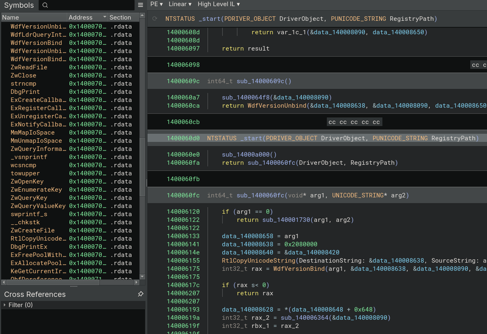
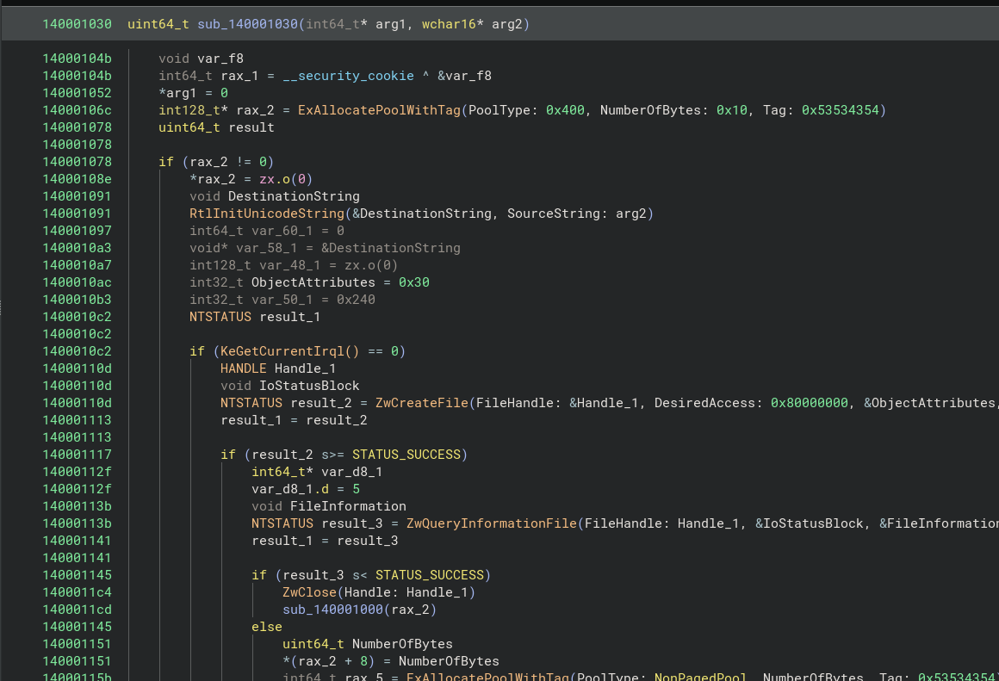
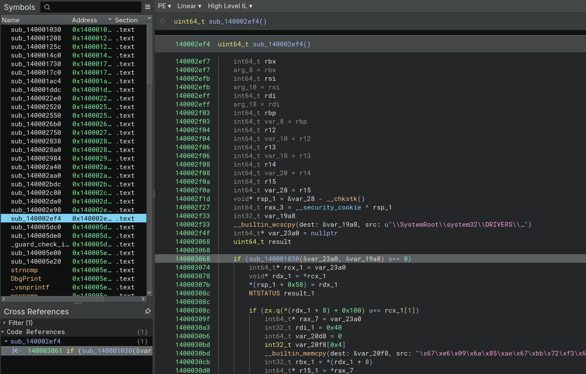
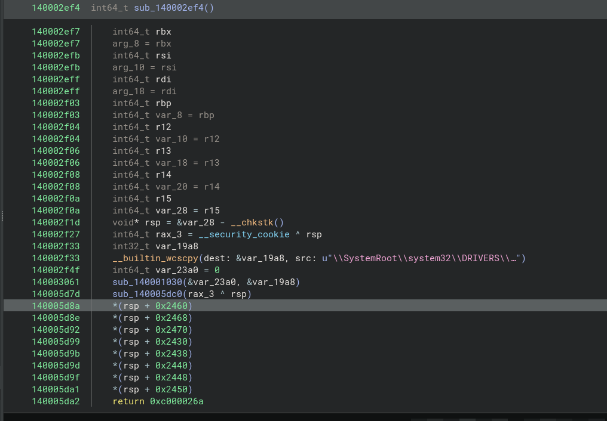
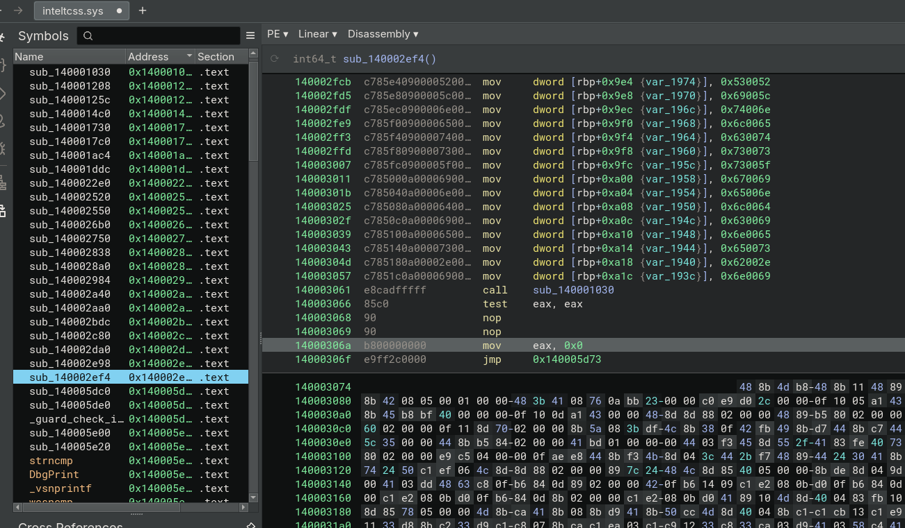

# Reverse-Drivers

### Legal Note:
This is a simple tutorial intended to share information on how reverse engineering a Windows driver can be done. I have legally purchased all the Coolstar drivers, as they have invested significant time and effort. You should respect that as well.

<hr/>
We are trying to break Intel TCSS licensing.

### Step 1: How does the installer work?
The setup file contents can be extracted using 7-Zip as shown below:


It uses `DPInst` to install the drivers. Each folder contains .cat, .inf, and .sys files. We are only interested in the .sys file, which contains the actual driver code.

There are two drivers: `intelpmc` and `inteltcss`. Which one is the main driver?
The pmc driver doesn't check the license; it just observes the status of the tcss driver. The tcss driver is the one that reads the license file.

`I'm going to use Binary Ninja, which is the most underrated binary reverse engineering tool.`

After opening the file, we first check the strings to see if there’s any reference to the license file name `inteltcss_signedlicense.bin` — but no results!

Next, we look for a function that reads a file. After checking the symbols, we hit the jackpot: `ZwReadFile` — exactly what we’re looking for.



By checking the code reference, we find a function that only checks the license file’s status and contents — nothing interesting there.



But when checking the reference to the parent function, we find one of the longest code segments in the file. It checks the license content by first double-hashing the data, then performing some sort of ECDSA verification, and finally checking if the data matches the HWID. It returns 0 on success.



All we need to do is avoid branching into the first if statement.



Then change the return value to 0x0. Now our driver file is ready!



### How to test if it works? 
We need to put Windows into `testsigning` mode, since Microsoft doesn’t allow signed drivers without a trusted certificate authority. After that, we can self-sign our driver file:

```sh
openssl req -new -x509 -days 3650 -keyout test.key -out test.crt
openssl pkcs12 -export -out test.pfx -inkey test.key -in test.crt
osslsigncode sign -pkcs12 test.pfx -pass password -n "password" -in inteltcss.sys -out inteltcss_patched.sys
```

Now, replace the original driver with the patched one at:
```
C:/Windows/System32/drivers
```

Restart and see the magic :)
